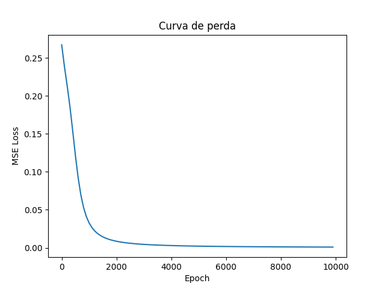

# Mini Neural Network

Rede neural de 2 camadas implementada **apenas com NumPy** — sem Keras, sem PyTorch, sem sklearn.

O objetivo é entender como ML funciona por baixo dos frameworks: forward pass, backpropagation e atualização de pesos feitos à mão. Treinada no dataset **XOR** como ponto de partida.

---

## Stack

- `numpy` — toda a matemática (álgebra linear, gradientes, broadcasting)
- `matplotlib` — visualização da loss curve durante o treino
- `Python` — sem frameworks

---

## Estrutura

```
mini-neural-net/
├── activations.py  # sigmoid e sua derivada
├── loss.py         # MSE e sua derivada
├── network.py      # classe RedeNeural (forward + backward)
├── train.py        # loop de treino
└── plot.py         # curva de loss
```

---

## Como rodar

```bash
# Clone o repositório
git clone https://github.com/seu-usuario/mini-neural-net.git
cd mini-neural-net

# Crie o ambiente virtual e instale as dependências
python -m venv .venv
source .venv/bin/activate  # Windows: .venv\Scripts\activate
pip install -r requirements.txt

# Rode o treino
python train.py

# Gere o gráfico da loss curve
python plot.py
```

---

## Arquitetura

```
Input (2) → Camada Oculta (8 neurônios) → Output (1)
```

**Forward pass:**
```
Z1 = X · W1 + b1
A1 = sigmoid(Z1)
Z2 = A1 · W2 + b2
A2 = sigmoid(Z2)  ← previsão
```

**Backward pass:**
```
∂L/∂ŷ → ∂L/∂Z (via sigmoid') → ∂L/∂W e ∂L/∂b
W -= lr · ∂L/∂W
b -= lr · ∂L/∂b
```

---

## Dataset: XOR

O XOR não é linearmente separável — a rede precisa de pelo menos uma camada oculta pra resolver.

| Entrada | Saída |
|---------|-------|
| [0, 0]  | 0     |
| [0, 1]  | 1     |
| [1, 0]  | 1     |
| [1, 1]  | 0     |

---

## Resultado

Parâmetros usados:

```python
net = NeuralNetwork(2, 8, 1)
epochs = 10000
lr = 0.3
```

Previsões finais:

```
Esperado:  [0,     1,     1,     0    ]
Obtido:    [0.018, 0.973, 0.973, 0.0312]
```

Menos de 3% de erro em todos os exemplos.



A rede aprende quase tudo nas primeiras 50 épocas — o restante é refinamento.
